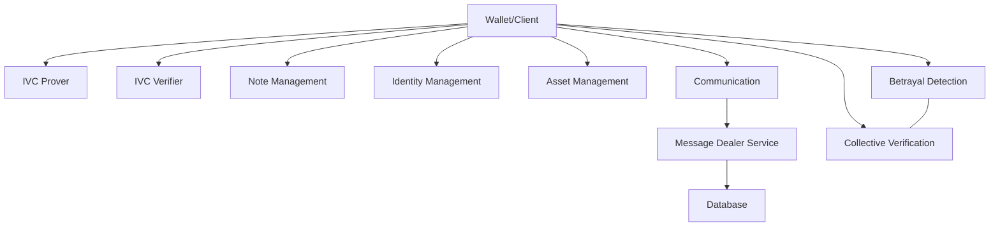
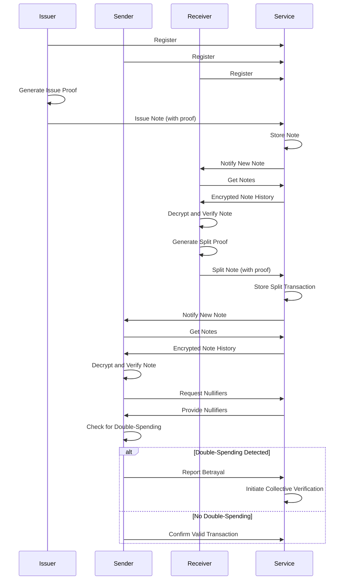

# IOU - ivcnotes: Privacy-Preserving Note Transfer System

ivcnotes is an advanced cryptographic system that enables private issuance and transfer of digital notes using incremental verifiable computation (IVC) and zero-knowledge proofs.

## Overview

The ivcnotes project implements a privacy-focused framework for managing digital assets or IOUs. It leverages cryptographic techniques to allow users to prove ownership and transfer notes without revealing their contents. The system's core strength lies in its use of incremental verifiable computation (IVC) for efficient proof generation and verification across multiple transfers.

### Key Features

- Private note issuance and transfer
- Zero-knowledge proof of note ownership
- Efficient IVC-based proof generation and verification
- Double-spending prevention with optional "heretic mode"
- Backend service integration for storage and communication

## Architecture

The ivcnotes system comprises the following main components:



1. **Wallet/Client**: Central user interface managing notes, proofs, and interactions.
2. **IVC Prover**: Generates zero-knowledge proofs for transactions.
3. **IVC Verifier**: Validates transaction proofs.
4. **Note Management**: Handles note lifecycle and UTXO-style operations.
5. **Identity Management**: Implements Semaphore-like identity scheme.
6. **Asset Management**: Defines and tracks asset metadata and terms.
7. **Communication**: Interfaces with external services and messaging platforms.
8. **Message Dealer Service**: Manages transaction message routing and storage.
9. **Database**: Persistent storage for system data.
10. **Betrayal Detection**: Implements collective double-spending checks.
11. **Collective Verification**: Coordinates group verification processes.

### Operating Modes

1. **Heretic Mode**: Allows potential double-spending, relying on trust and collective detection.
2. **Safe Mode**: 
   - Central: Uses a centralized service for nullifier logging.
   - Decentral: Logs nullifiers to a blockchain (L1 or L2).

## Key Concepts

- **Notes**: UTXO-like fungible assets with partial transfer capability.
- **Assets**: Metadata defining note terms and issuer information.
- **Transactions**: Issue or split actions for note creation and transfer.
- **States**: Compact Merkle tree representations of valid notes.
- **Nullifiers**: Blinded identifiers for double-spending/betrayal detection.
- **IVC**: Enables efficient proof chaining across multiple transfers.

### SNARK Circuit

The zero-knowledge proof circuit enforces:
- Identity commitment and nullifier integrity
- Signature verification
- Input/output state integrity
- Note reconstruction
- State transition rules

## System Flow



## Implementation Details

- **Language:** Rust
- **Cryptographic Libraries:** arkworks
- **Custom Components:** Poseidon hash functions
- **Serialization:** serde
- **Backend Integration:** HTTP-based service communication (Reqwest)
- **Database:** Mongodb
- **GitHub Organisation:** [IVCNotes](https://github.com/iou-experiments/ivcnotes) - [Backend Service](https://github.com/iou-experiments/service)

## Future Work

1. Implement advanced note types and transfer mechanisms
2. Enhance privacy features (e.g., stealth addresses)
3. Optimize proof generation/verification for improved scalability
4. Expand smart contract functionality
5. Develop user-friendly interface for note management

## Conclusion

ivcnotes represents a significant advancement in privacy-preserving digital asset management. By combining zero-knowledge proofs with incremental verifiable computation, it offers a secure and efficient framework for transferring digital assets while maintaining user privacy. This system has potential applications in various fields, from financial instruments to supply chain management, where privacy and verifiability are paramount.


-------------------

## MPC Research:

### Potential MPC Integration for Note Verification

Multi-Party Computation (MPC) offers exciting possibilities for enhancing the security and privacy of the ivcnotes system, particularly in the realm of note verification. Here's how MPC could be integrated:

### MPC for Collective Verification

1. **Distributed Verification**: Instead of relying on individual users or a central authority, MPC could enable a group of participants to jointly verify notes without revealing their individual inputs.
2. **Privacy-Preserving Betrayal Detection**: MPC protocols could allow multiple parties to check for double-spending without exposing the actual nullifiers or transaction details.
3. **Threshold Cryptography**: Implement a t-of-n threshold scheme where a subset of participants can collectively verify a note, increasing resilience against individual node failures or compromises.

### Potential Benefits

- **Enhanced Privacy**: MPC could further reduce the information leaked during the verification process.
- **Increased Security**: By distributing the verification process, the system becomes more resistant to single points of failure or compromise.
- **Scalability**: MPC could potentially allow for more efficient collective verification in large networks.

### Implementation Considerations

1. **Protocol Selection**: Choose appropriate MPC protocols that balance security, efficiency, and the specific needs of note verification (e.g., SPDZ, BGW, or more recent advancements).
2. **Integration with IVC**: Explore how MPC can complement or enhance the existing IVC-based proof system.
3. **Performance Optimization**: Address the computational overhead of MPC to ensure the system remains practical for real-time transactions.
4. **Network Requirements**: Consider the communication complexity and network requirements for running MPC protocols among participants.

### Future Research Directions

- Investigate hybrid systems combining ZKPs, IVC, and MPC for optimal privacy and efficiency.
- Explore the use of MPC for other aspects of the system, such as private asset issuance or terms negotiation.
- Develop tailored MPC protocols specifically designed for the needs of privacy-preserving note systems.

By integrating MPC, the ivcnotes system could potentially offer even stronger privacy guarantees and more flexible verification options, further enhancing its utility in sensitive financial applications and complex multi-party scenarios.

### MPC: Betrayal Detection System

```mermaid
sequenceDiagram
    participant Sender
    participant Service
    participant MPC Node 1
    participant MPC Node 2
    participant MPC Node 3

    Note over Sender,MPC Node 3: Initialization
    Sender->>Service: Request Betrayal Check
    Service->>Service: Divide historical nullifiers into shares

    Note over Sender,MPC Node 3: Distribution
    Service->>MPC Node 1: Send nullifier share 1
    Service->>MPC Node 2: Send nullifier share 2
    Service->>MPC Node 3: Send nullifier share 3
    Sender->>MPC Node 1: Send encrypted new nullifier
    Sender->>MPC Node 2: Send encrypted new nullifier
    Sender->>MPC Node 3: Send encrypted new nullifier

    Note over MPC Node 1,MPC Node 3: Computation
    MPC Node 1->>MPC Node 1: Compare with share 1
    MPC Node 2->>MPC Node 2: Compare with share 2
    MPC Node 3->>MPC Node 3: Compare with share 3
    MPC Node 1<->>MPC Node 2: Exchange partial results
    MPC Node 2<->>MPC Node 3: Exchange partial results
    MPC Node 3<->>MPC Node 1: Exchange partial results

    Note over MPC Node 1,MPC Node 3: Aggregation
    MPC Node 1->>Service: Submit partial result
    MPC Node 2->>Service: Submit partial result
    MPC Node 3->>Service: Submit partial result
    Service->>Service: Combine results

    Note over Sender,Service: Result
    alt Double-Spending Detected
        Service->>Sender: Report Betrayal
    else No Double-Spending
        Service->>Sender: Confirm Valid Transaction
    end
```

--------------

### Challenges and Limitations of MPC Integration

While Multi-Party Computation offers promising benefits, it's important to acknowledge the potential issues that come with its integration into the ivcnotes system:

1. **Scalability Concerns**
   - **Computational Overhead**: MPC protocols often involve significant computational costs, which can increase exponentially with the number of participants.
   - **Communication Complexity**: Many MPC protocols require multiple rounds of communication between parties, potentially leading to high latency in large networks.
   - **Performance Degradation**: As the number of parties increases, the system's performance may degrade, potentially making it impractical for real-time transactions in large-scale deployments.
2. **Limited Real-World Implementations**
   - **Lack of Battle-Tested Solutions**: While MPC has been extensively studied academically, there are relatively few large-scale, production-ready implementations in financial systems.
   - **Immaturity in Blockchain Context**: The integration of MPC with blockchain and cryptocurrency systems is still in its early stages, with limited data on long-term viability and security.
3. **Implementation Complexity**
   - **Protocol Design Challenges**: Designing efficient and secure MPC protocols tailored to note verification is a complex task requiring specialized expertise.
   - **Integration Difficulties**: Seamlessly integrating MPC with existing ZKP and IVC systems presents significant technical challenges.
4. **Operational Challenges**
   - **Participant Coordination**: Ensuring all required parties are available and responsive for MPC computations can be logistically challenging.
   - **Fault Tolerance**: Handling scenarios where participants become unavailable or malicious during the computation process adds complexity.
5. **Limited Performance Data**
   - **Lack of Benchmarks**: There's a scarcity of comprehensive performance data for MPC in systems similar to ivcnotes, making it difficult to predict real-world behavior.
   - **Uncertain Efficiency Gains**: It's not clear whether the privacy benefits of MPC would outweigh the potential performance costs in all use cases.
6. **Regulatory Uncertainty**
   - **Compliance Challenges**: The use of MPC might complicate compliance with regulatory requirements, especially in financial systems where auditability is crucial.
   - **Novel Legal Territory**: The legal implications of using MPC for financial transactions are not yet fully explored or defined in many jurisdictions.
7. **User Experience Considerations**
   - **Complexity for End-Users**: MPC might add another layer of complexity to the system, potentially impacting user experience and adoption.
   - **Increased Transaction Times**: The additional computation and communication required by MPC could lead to longer transaction confirmation times.

## How to use

Make sure you have Rust & cargo on your system, clone the repo

```bash
cargo run --example keygen --release
```

then install

```bash
./install.sh
```

### Commands

1. Create account

```bash
cargo run create --pass 0
```

2. View accounts

```bash
notes info
```

3. View and Switch between accounts

```bash
notes switch   
```

4. Register account with service (password, unique username)

```bash
notes register --pass 17 --user 0xsero 
```

5. Issue a note (password, receiver, value)

```bash
notes issue --pass 17 0xsero 100
```

6. Get and store notes (password, username)

```bash
notes notes --pass 1 sero  
```

7. Split and transfer a note (password, from, note index, to, amount)

```bash
notes transfer --pass 17 --from 0xsero 0 sero 25 
```


8. Wipe and Reset

```bash
notes reset
```